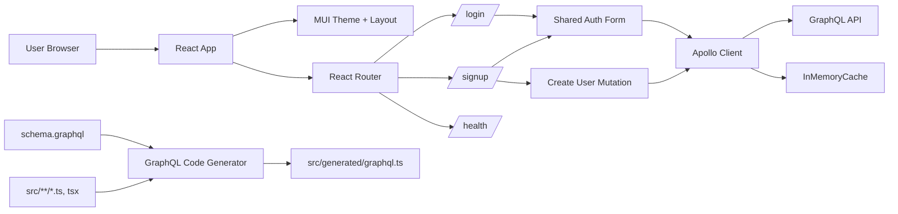

# RealTime Chat UI
Use this repo as backend : https://github.com/willyyypatootieee/RTChat-Backend
Minimal documentation for the RT Chat UI frontend, including the current system diagram, stack, and the main project wiring.

## System diagram



## Stack

### Core frontend
- **React 19** for the UI
- **TypeScript** for type-safe development
- **Create React App** (`react-scripts`) as the build/runtime setup
- **React Router v7** for routing
- **Material UI v9** + **Emotion** for styling and theming

### Data layer
- **Apollo Client v4** for GraphQL requests and cache management
- **GraphQL** runtime package for schema/query support
- **GraphQL Code Generator** for generated TypeScript types and operation helpers

### Testing and tooling
- **Testing Library** (`@testing-library/react`, `jest-dom`, `user-event`)
- **TypeScript compiler** with CRA defaults

## Project structure

The main app flow is:

1. `src/index.tsx` boots the application.
2. `src/App.tsx` wraps the app with:
   - `ApolloProvider`
   - `ThemeProvider`
   - `CssBaseline`
   - `RouterProvider`
3. `src/components/Routes.tsx` defines the routes:
   - `/login`
   - `/signup`
   - `/health`
4. `src/components/auth/` contains the login and signup screens.
5. `src/components/health/Health.tsx` provides a simple status page.
6. `src/constants/apollo-client.ts` points Apollo Client to `${REACT_APP_API_URL}/graphql`.
7. `src/generated/graphql.ts` contains generated GraphQL types.

## GraphQL workflow

- The schema is stored in `schema.graphql`.
- Operations and fragments are collected from `src/**/*.{ts,tsx}`.
- `yarn codegen` regenerates `src/generated/graphql.ts`.
- Apollo config files (`apollo.config.js`, `graphql.config.js`, `codegen.yml`) keep the frontend GraphQL setup aligned.

## Environment variables

| Variable | Purpose |
| --- | --- |
| `REACT_APP_API_URL` | Base URL used by Apollo Client to reach the backend GraphQL API. |

## Available scripts

```bash
yarn start   # Start the dev server
yarn build   # Build a production bundle
yarn test    # Run the test runner
yarn codegen # Generate GraphQL TypeScript artifacts
```

## Notes

- The current README is intentionally lightweight and focused on documentation.
- The application uses a local GraphQL schema file plus generated types to keep UI code typed.
